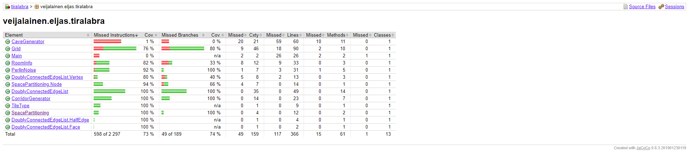
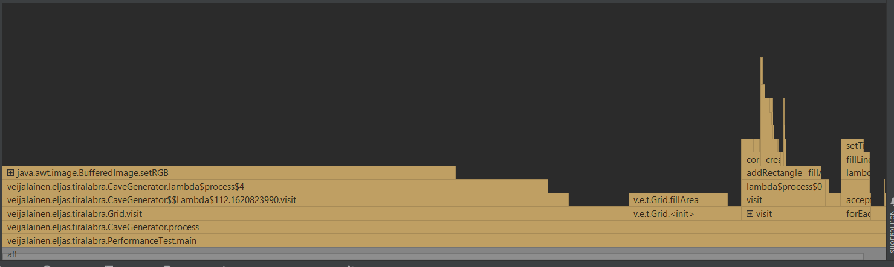

# Testaus

## Yksikkö- ja integraatiotestaus
Tällä hetkellä yksikkötesteillä testattuna on tietorakenteen perustapauksia ja integraatiotestinä katsotaan, onko kaikki huoneet yhteydessä toisiisna.

Yksikkötestauksen testikattavuus

Testit voidaan kokeilla komennolla
``mvn test``

## Suorituskykytestaus
Muun koodin joukossa on PerformanceTest-luokka, jossa on main-metodi. Se mittaa aikaa 1 luolaston generaatioon. Sain omalla koneella tulokseksi

``1 generointia kesti 1419ms``

Nyt suorituskyky eroaa edellisten viikkojen suorituskyvystä, kun soluautomaatti on käytössä.
Soluautomaatin takia aikatilaavuus on O(leveys*korkeus). 
Nykyään pysäytetään, kun kartta ei enää muutu.

## Muu testaus
Seuraava kuva on melkein valmis algoritmi. Kuva on generoitu oletussyötteillä ja se näyttää halutulta.

Kuvassa on kasvustolla päällystettyjä ja päällystämättömiä huoneita

Lisäksi ohjelman eri vaiheita voidaan testata VisualiseAll- luokan main-metodilla. 
Perlin Noisen toimivuus voidaan tarkastaa PerlinVisualiser- luokan main-metodilla.