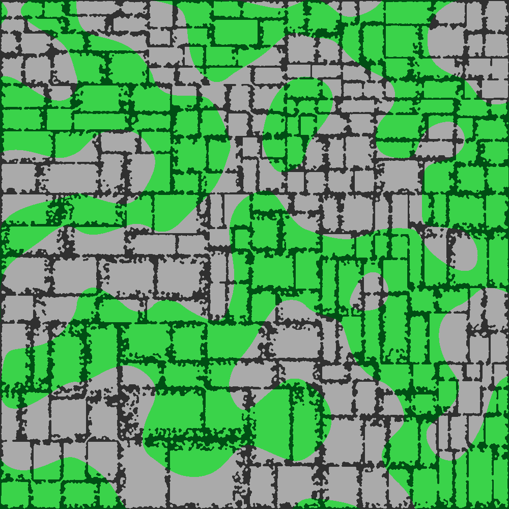

# Testaus

## Yksikkötestaus
Tällä hetkellä yksikkötesteillä testattuna on muutama tietorakenteen perustapaus

Yksikkötestauksen testikattavuus

## Suorituskykytestaus
Muun koodin joukossa on PerformanceTest-luokka, jossa on main-metodi. Se mittaa aikaa 1 luolaston generaatioon. Sain omalla koneella tulokseksi

``1 generointia kesti 13385ms``

Nyt suorituskyky eroaa edellisten viikkojen suorituskyvystä, kun soluautomaatti on käytössä.
Soluautomaatin takia aikatilaavuus on O(leveys*korkeus). 
Tulevaisuudessa soluautomaatti voidaan pysäyttää, kun kartta ei enää muutu.

## Muu testaus
Seuraava kuva on kehitysvaiheessa oleva algoritmi. Kuva on generoitu oletussyötteillä ja se näyttää halutulta.

Musta väri on seinää ja valkoinen lattiaa.
