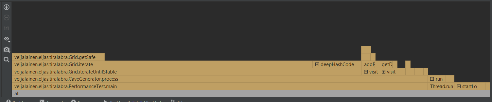

# Testaus

## Yksikkötestaus
Tällä hetkellä yksikkötesteillä testattuna on muutama tietorakenteen perustapaus

Yksikkötestauksen testikattavuus

## Suorituskykytestaus
Muun koodin joukossa on PerformanceTest-luokka, jossa on main-metodi. Se mittaa aikaa 1000 luolaston generaatioon. Sain omalla koneella tulokseksi

``1000 generointia kesti 22508ms``

Yhden luolaston generointi kestää noin 22 millisekuntia.

Profilointikuvassa näkyy, että noin puolet prosessointiajasta käytetään kuvan piirtämiseen.
## Muu testaus
Seuraava kuva on kehitysvaiheessa oleva algoritmi. Kuva on generoitu oletussyötteillä ja se näyttää halutulta.

Kuvassa on viereiset huoneet yhdistetty käytävillä.
